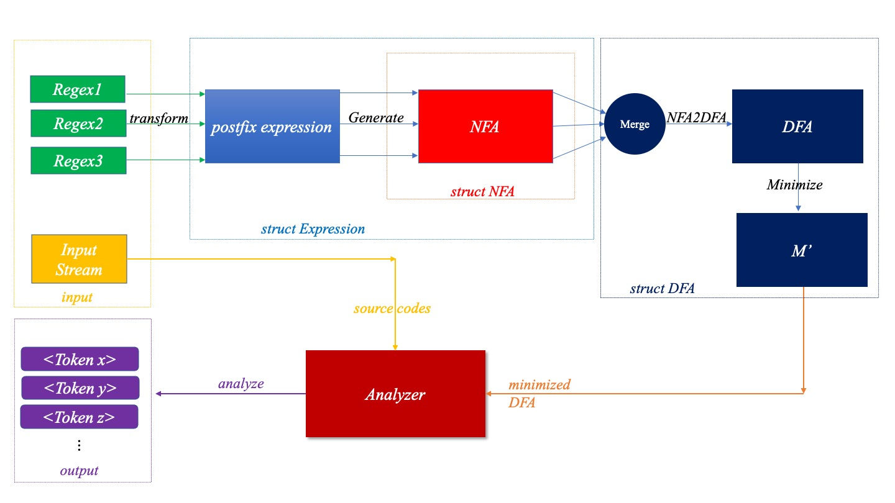

# 编译原理作业--词法分析程序

*本文档使用markdown格式*
*为了更好的视觉效果，*
*建议您使用支持markdown的阅读器*

## 文件目录说明

- Makefile 本项目使用makefile辅助开发
- readme.md 本说明文件
- bin/: 可执行文件
- src/: 源代码文件
- obj/: 目标文件
- test/: 测试输入输出数据

## 测试复现

```bash
   make clean && make build
```

该测试默认读取test/input/tokens.txt中制定的token及其对应的正则表达式，并形成最小化的DFA(可视化mermaid代码输出至test/output/mermaid.txt中)，而后对目标代码文件test/input/sourceCodes.txt读取并进行词法分析工作，结果输出至test/output/tokenized.txt中。

注：

- 对于生成的最小化DFA， 您可以使用支持mermaid语法的渲染工具对mermaid.txt中的内容进行可视化渲染，这一点在[DFA可视化](#DFA可视化)部分会重点说明。

## DFA可视化

在进行程序设计的过程中，我注意到可视化的将生成DFA图结构可视化的显示出来，非常有利于理解流程和排查错误。

因此，本项目支持将DFA自动的转换为mermaid语法所支持的状态图形式. 具体而言，在代码中make_mermaid(DFA),将会自动将对应DFA转换并输出至test/output/mermaid.txt中。您可以使用支持mermaid的工具进行可视化渲染，这里推荐一款在线工具(https://mermaid.live)

注：

- 值得注意的是，如果您的DFA过于庞大（例如，由test/input/tokens.txt生成的DFA），那么在线渲染工具的分辨率则差强人意。您可能需要使用本地化的渲染工具

## 流程示意图



## 约定

本项目遵循一定的设计前提，因此如果您希望自定义token正则表达式，源代码结构，您需要参考以下内容：

- 正则表达式文件

  - 本项目支持的正则表达式算符：
    - Kleen Closure: *
    - Positive Clousure: +
    - Selective: ?
    - Union: |
    - Concatenate: # (您不需要显示地添加连接算符，因为程序会自动的为您添加上；例如: 连接两个字符：$a\cdot b, \text{or}, a\#b$, 您只需要使用$ab$)
  - 需要匹配的字符与上述正则表达式算符冲突？
    - 使用\转义即可
  - 所有的token及其正则表达式均以 `<name>`: `<pattern>` 的格式独占一行
  - 请不要出现空行
  - 行与行间的前后次序是有关的，因此在冲突解决中，我们可能需要优先匹配出现在前的token
    如果您对于以上的规则感到疑惑，可以参考test/input/tokens.txt这个例子
- 源代码结构:

  - 字符集：所有的阿拉伯数字，大小写字母，以及< = > ! _ Space ; 当然，如果您在正则表达式中使用转义说明的其他字符也会被自动的添加到字母表中。
  - 字母表：根据您制定的正则表达式文件，最终的字母表可能是上述集合的一个子集，程序会自动的确定这一点，从而识别出合适的字母表
  - 在目前的设计中，暂不支持错误修复机制，换言之，源代码文件要求能够完全匹配正则表达式文件中所规定的所有条目；当然这是不合理的，在下一阶段，我会为其添加错误修复机制。

## 使用

```bash
   bin/analyzer <tokens.txt> <sourceCode.txt> <tokenized.txt>
```

- <tokens.txt> 包含您所规定的正则表达式，注意每条独占一行，具体的格式参考文末
- <sourceCode.txt> 包含您需要坐词法分析的目标源代码
- <tokenized.txt> 将会作为分词结果输出的文件地址

注：

- 默认情况下，对应生成最小化DFA的mermaid可视化代码也会自动生产在test/output/mermaid.txt文件中

## 编译环境

**本项目测试开发所采用的编译器信息:**

```
Apple clang version 14.0.0 (clang-1400.0.29.202)
Target: arm64-apple-darwin22.2.0
Thread model: posix
```

## Git

本项目的开发使用Git进行了版本管理，您可以通过git log来查看开发过程中的历史版本信息。
