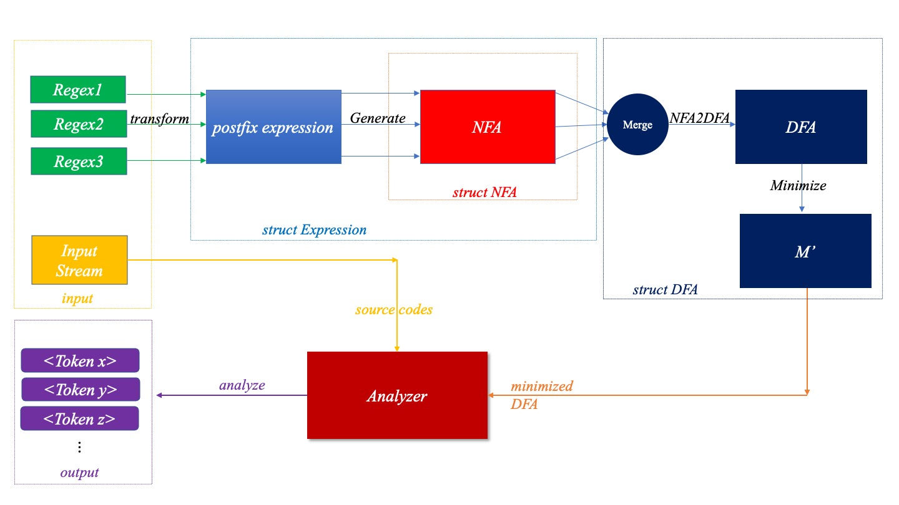

# 编译原理作业--题目2.1正则表达式的识别题目1.3

*本文档使用markdown格式*
*为了更好的视觉效果，*
*建议您使用支持markdown的阅读器*

## 文件目录说明

- Makefile 本项目使用makefile辅助开发
- readme.md 本说明文件
- bin/: 可执行文件
- src/: 源代码文件
- obj/: 目标文件
- test/: 测试输入输出数据

## 测试复现

1. 清除可能存在的二进制文件或目标文件

   ```bash
   make clean
   ```
2. 正则表达式识别与模拟

   ```bash
   make -e DEBUG=1 test
   ```

   以上命令会自动执行并测试以下两项任务:

   1. 给定一组正则表达式$\mathcal{R}$

      - $\forall r \in \mathcal{R}$, 构建对应的NFA
      - 输出NFA对应的Transition Table。
        注：该项任务所测试的输入: test/input/regex.txt;
   2. 给定一个正则表达式$\mathcal{r}$，与一组待判定字符串集合$\mathcal{S}$;

      - $\forall s \in \mathcal{S}$, 判断$s \in \mathcal{L}(r)$
        注:该项任务所使用的输入与预期输出: test/{input,output}/regex.txt

## 流程示意图

如图所示：对于给定的正则表达$regex$，首先转换为后缀表达式的形式，其次依照McNaughton-Yamada-Thompson算法搭建NFA结构；若给定了待匹配的字符串$String$，则最终使用模拟NFA的方法给出$String$是否匹配正则表达式$regex$的模式。



## 使用

1. 编译

   ```bash
   make build
   ```
2. 执行

   ```bash
   # src/Simulator "<regex>" "<string>"
   src/Simulator "a|bc*" "bccc"
   ```

***注意***
- 在CLI中执行程序，您的正则表达式与待匹配的字符串均需要使用双引号包裹起来，避免与shell的特殊字符冲突。
- 目前本程序支持正则表达式中常见的运算符包括: $|$ (Union), $\cdot$(Concatenation), *(KleenClosure), $^+$(Postive Closure), ?(Selective)。 其中连接算符($\cdot$) 并不需要您显式的写在表达式中。

## 编译环境

**本项目测试开发所采用的编译器信息:**

```
Apple clang version 14.0.0 (clang-1400.0.29.202)
Target: arm64-apple-darwin22.2.0
Thread model: posix
```

## Git

本项目的开发使用Git进行了版本管理，您可以通过git log来查看开发过程中的历史版本信息。